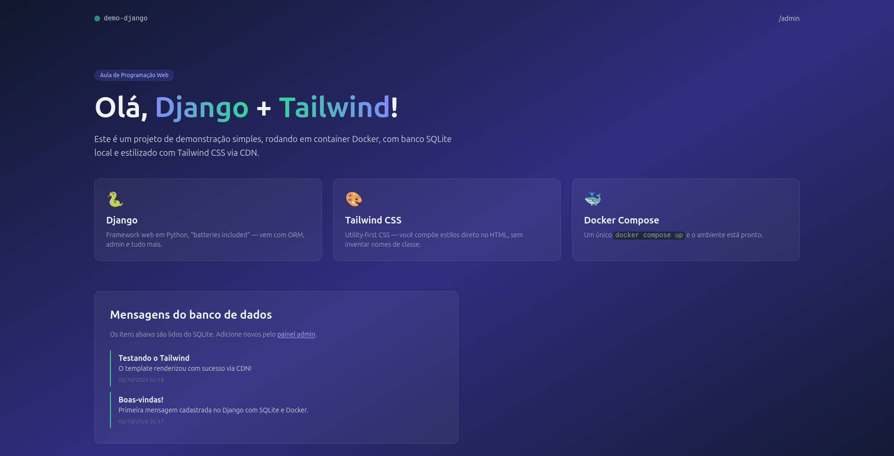
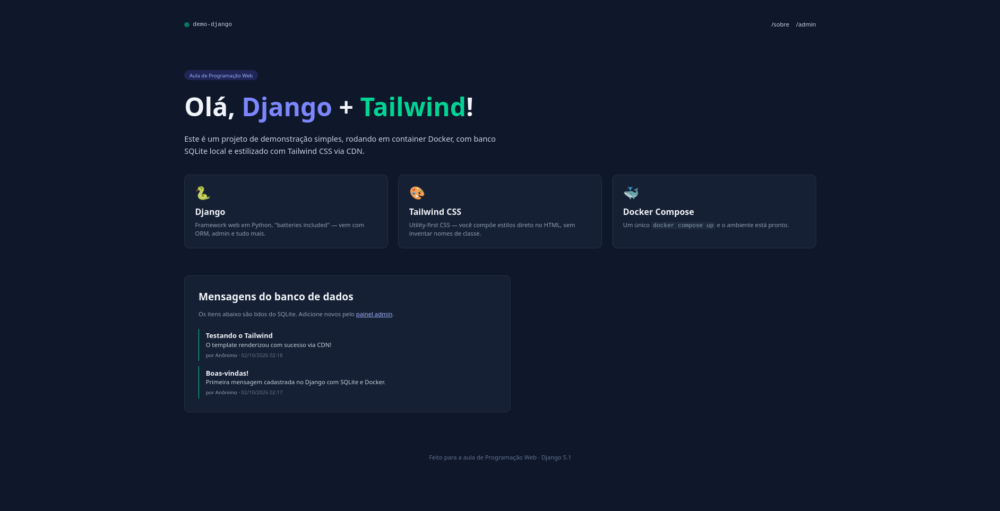

# Programação Web 🌐

**Instituição:** Universidade Federal de Ouro Preto (UFOP)  
**Curso:** Ciência da Computação  
**Disciplina:** Programação Web  
**Professora:** Aline  
**Aluna:** Samara Paloma Lopes Augusto Ribeiro  

Repositório destinado ao armazenamento das atividades, roteiros práticos e projetos desenvolvidos ao longo da disciplina.

---

## 📍 Roteiros Práticos

### Backend (Django)
- [x] **Roteiro 05:** Introdução ao Django (Projeto Inicial)
- [x] **Roteiro 06:** Criando modelos e rotas com Django

---

## 📸 Demonstração do Sistema em Execução

### Roteiro 05 - Aplicação Django Rodando (Parte 1)

### Roteiro 06 - Criando Modelos e Rotas com Django (Parte 2)

